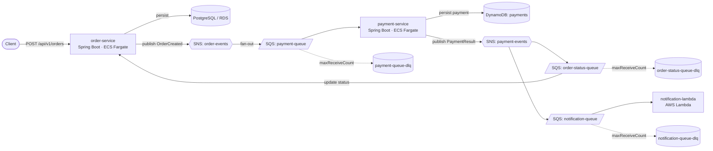

# Event-Driven Order Processing System on AWS

A small but production-shaped, cloud-native backend that simulates **order → payment → notification**
processing using an **event-driven architecture**. Built with Java 21 / Spring Boot microservices,
AWS Lambda, ECS Fargate, SNS, SQS (with DLQs), DynamoDB, PostgreSQL, CloudWatch, Docker, Terraform,
and GitHub Actions CI/CD.

---

## Architecture



### Flow

1. A client `POST`s an order to **order-service**. It is persisted to **PostgreSQL** (status `CREATED`)
   and an `OrderCreated` event is published to the **order-events** SNS topic.
2. SNS fans the event out to the **payment-queue**. **payment-service** consumes it, attempts payment
   through a simulated gateway, writes a ledger entry to **DynamoDB**, and publishes a `PaymentResult`
   event to the **payment-events** SNS topic.
3. `payment-events` fans out to two queues:
   - **order-status-queue** → order-service updates the order to `PAID` / `PAYMENT_FAILED`.
   - **notification-queue** → **notification-lambda** "notifies" the customer.
4. Every queue has a **dead-letter queue**. After `maxReceiveCount` failed deliveries the poison message
   is moved to the DLQ and a **CloudWatch alarm** fires.

### Resume-feature mapping

| Feature | Where it lives |
| --- | --- |
| Java / Spring Boot microservices | `order-service/`, `payment-service/` |
| REST APIs | `OrderController` (`/api/v1/orders`) |
| AWS Lambda | `notification-lambda/` (Java 21, partial-batch-failure handling) |
| ECS Fargate | `infra/terraform/ecs.tf` |
| SNS pub/sub | `order-events`, `payment-events` topics |
| SQS queues | `payment-queue`, `order-status-queue`, `notification-queue` |
| DynamoDB | `payment-service` payment ledger (`payments` table) |
| PostgreSQL | `order-service` order store (RDS in AWS) |
| Event-driven architecture | SNS→SQS fan-out, async consumers |
| CloudWatch monitoring | `infra/terraform/cloudwatch.tf` (alarms + dashboard), Micrometer/Prometheus metrics |
| Docker containers | `*/Dockerfile`, `docker-compose.yml` |
| CI/CD pipelines | `.github/workflows/ci.yml`, `cd.yml` |
| Fault tolerance with DLQs | redrive policies on every queue + DLQ alarms |

---

## Project layout

```
event-processing-system/
├── pom.xml                     # parent (multi-module reactor)
├── common/                     # shared event contracts (records) + constants
├── order-service/              # REST API, JPA/Postgres, SNS publisher, SQS listener
├── payment-service/            # SQS consumer, DynamoDB, SNS publisher, payment gateway
├── notification-lambda/        # AWS Lambda (SQS-triggered), shaded fat jar
├── infra/terraform/            # SNS, SQS+DLQ, DynamoDB, RDS, ECS Fargate, Lambda, CloudWatch
├── localstack/init/            # bootstrap script that provisions the topology locally
├── scripts/demo.sh             # end-to-end smoke test against the local stack
├── docker-compose.yml          # LocalStack + Postgres + both services
└── .github/workflows/          # ci.yml (build/test/docker), cd.yml (ECR + Terraform + ECS)
```

---

## Build & test

Requires JDK 21 and Maven.

```bash
mvn verify
```

This compiles all modules, runs the unit tests (order/payment/notification logic, idempotency,
DLQ-failure reporting) and produces:

- `order-service/target/order-service.jar`
- `payment-service/target/payment-service.jar`
- `notification-lambda/target/notification-lambda.jar` (shaded, deployable to Lambda)

---

## Run locally (end-to-end with LocalStack)

Requires Docker + Docker Compose. LocalStack emulates SNS/SQS/DynamoDB/Lambda so no AWS account
is needed.

```bash
# 1. Build the jars first (the Lambda jar is mounted into LocalStack)
mvn -DskipTests package

# 2. Start everything (LocalStack provisions the topology via localstack/init/01-bootstrap.sh)
docker compose up --build

# 3. In another terminal, drive the flow
./scripts/demo.sh 42.50 customer-123      # small amount -> usually PAID
./scripts/demo.sh 5000 customer-456       # over limit  -> PAYMENT_FAILED
```

Manual calls:

```bash
# create an order
curl -X POST localhost:8080/api/v1/orders \
  -H 'content-type: application/json' \
  -d '{"customerId":"c1","amount":42.50,"currency":"USD"}'

# fetch it (watch status flip from CREATED -> PAID/PAYMENT_FAILED)
curl localhost:8080/api/v1/orders/<id>

# inspect the queues / DLQs through LocalStack
docker compose exec localstack awslocal sqs list-queues
docker compose exec localstack awslocal dynamodb scan --table-name payments
```

Health/metrics: `localhost:8080/actuator/health`, `localhost:8080/actuator/prometheus`.

---

## Deploy to AWS

Infrastructure is defined with **Terraform** in `infra/terraform/`.

```bash
cd infra/terraform
terraform init
terraform apply \
  -var="order_service_image=<acct>.dkr.ecr.<region>.amazonaws.com/eps/order-service:latest" \
  -var="payment_service_image=<acct>.dkr.ecr.<region>.amazonaws.com/eps/payment-service:latest"
```

This creates: 2 SNS topics, 3 SQS queues + 3 DLQs (with redrive + queue policies), the DynamoDB
table, an RDS PostgreSQL instance, an ECS Fargate cluster with both services (task + execution
IAM roles scoped to least privilege), the notification Lambda with an SQS event-source mapping,
ECR repos, CloudWatch log groups, alarms (DLQ-not-empty, queue backlog, Lambda errors) and an
overview dashboard.

### CI/CD

- **`ci.yml`** runs on every push/PR: `mvn verify` + validates both Docker images build.
- **`cd.yml`** runs on a `v*` tag (or manual dispatch): builds & pushes images to ECR (via OIDC),
  `terraform apply`, then forces a new ECS deployment. Configure repo variables `AWS_REGION`,
  `PROJECT` and secrets `AWS_DEPLOY_ROLE_ARN`, `DB_PASSWORD`.

---

## Design notes

- **Idempotency / at-least-once delivery.** SQS delivers at-least-once, so consumers are idempotent:
  order-service ignores payment results for already-resolved orders; payment-service keys the DynamoDB
  ledger on `orderId` so a redelivered `OrderCreated` re-emits the prior result instead of double-charging.
- **Fault tolerance.** A thrown exception in a Spring `@SqsListener` leaves the message on the queue for
  redelivery; after `maxReceiveCount` it lands in the DLQ. The Lambda uses `ReportBatchItemFailures` so
  only failed records in a batch are retried.
- **Decoupling.** Services never call each other directly — they communicate purely through SNS/SQS,
  so each can scale, fail, and deploy independently.
- **Local/prod parity.** `localstack/init/01-bootstrap.sh` mirrors the Terraform topology, so the local
  Compose stack behaves like the deployed system.
```
